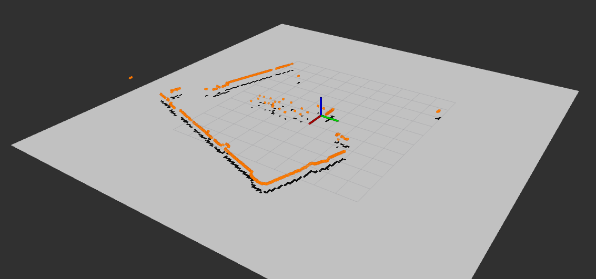
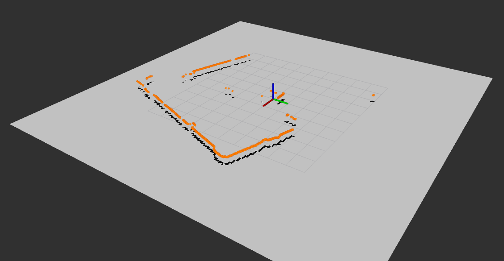
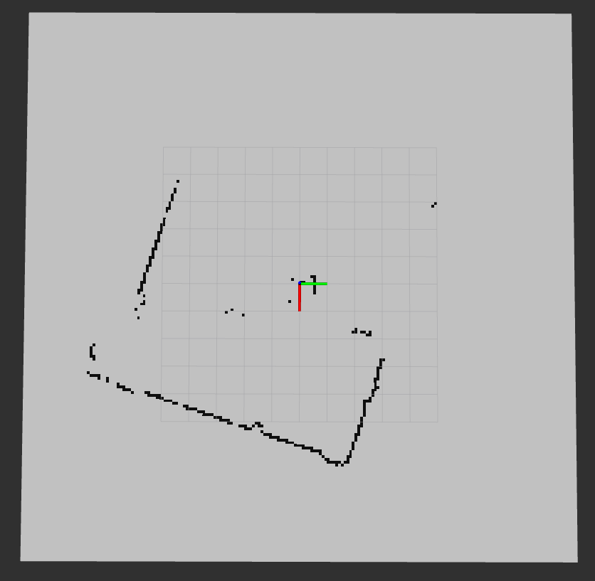

# Homework 2

## Description

```
1. Реализовать ноду, которая подписана на топик, содержащий лазерные сканы, и фильтрует эти данные - надо выкинуть все выбросы. Результат отобразить в Rviz. Тип сообщения - sensor_msgs/LaserScan

2. Реализовать ноду, которая по лазерному скану строит карту занятости, состоящую из ячеек, содержащую вероятность ячейки быть занятой. Можно для простоты считать, что вероятность равна либо 0, либо 1. (0, если никакая точка скана не попадает в ячейку карты, 1 - если хотя бы одна попадает). А можно придумать любой способ, позволяющий ячейке принимать промежуточные значения. Результат отобразить в Rviz. Тип сообщения - nav_msgs/occupancy_grid
```

## Usage

```bash
roscore
source devel/setup.bash
rosrun lasers scans.py

# run visualization
rviz -d visual.rviz

# push 1 scan from datafile
# for example
rosbag play -s 90 -u 0.05 2011-01-25-06-29-26.bag
```

## Results

### Points and map visualization
<table>
  <tr>
    <td>Before filtering</td>
     <td>After filtering</td>
  </tr>
  <tr>
    <td> </td>
    <td></td>
  </tr>
</table>

### Map visualization
